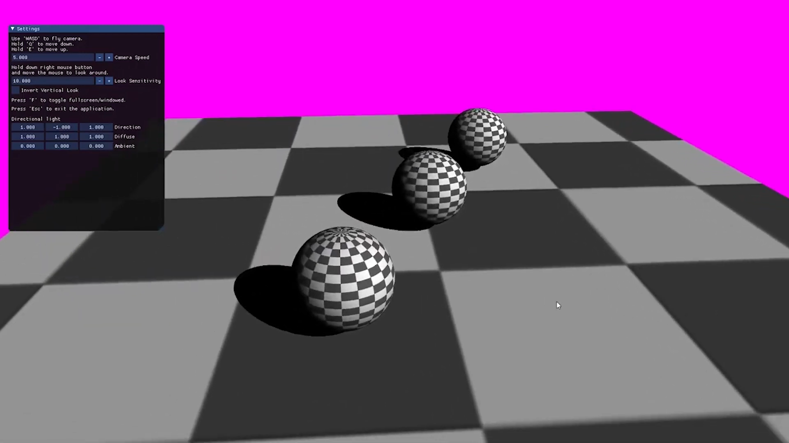

# DXR raytraced hard shadows

  

<a href="https://www.youtube.com/watch?v=RjFkShubgc8"><b>Demo video.</b></a>

## Requirements
Windows 10 and a GPU that supports Direct3D12 and DirectX Raytracing is required.

## Build steps
* Open the solution file in Visual Studio and select a configuration to build. 
* Building the solution will output the built executable called GameEngine.exe in SolutionDirectory/bin/x64-configuration. 

## Source code
Source code is available in Demo/.
